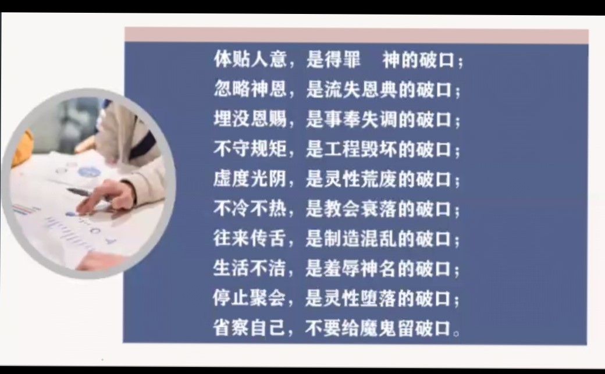
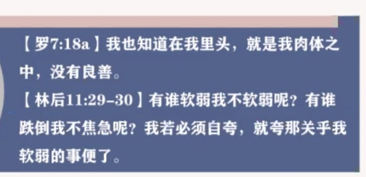

### 不要给魔鬼留地步

*  看到参孙 就是因为在情欲上留下了破口，以至于最后的结局不是很好还有就是。保罗知道自己生命的软弱在哪里 但是靠着基督去胜过破口是制约你生命成长的因素，
  
  不是你的缺点 不是你生命当中比别人不好的地方可能在游戏当中，在情欲当中被引诱去犯罪，每个人生命的破口都不一样，以及怎么去处理这个破口，知道哪个地方是浪费我时间的那个地方，可能就是我们生命中的破口，针对性的解决自己的问题，知道自己不好的地方不断改进才能得到成长👩‍🎓
*  体贴人意是得罪神的，你的短板可能是常常读经但是却走马观花，可能是为主做工，但你从来不祷告，可能你常常聚会但是总是心不在焉，忽略神的恩典就是你的灵性破口😭

* 当有了破口之后，首先是对自己的，团体，家庭，国家的伤害，一个小小的错误如果不加以重视，可能会带来极大的影响，我们可能在群体中，都会很好但是你自己的破口你自己知道，不能轻视，今天我们可能可以瞒过人，但是我们不能瞒住神，魔鬼会在这个事情上会来控告你，会继续引诱你犯罪得罪神，生命中的漏证会流失你生命当中的祝福，要在神的面前警醒，求神来光照不能轻视，可能到时候会酿成更大的恶行，不要让自己活在欺骗当中，特别是常常跌倒的问题，不单单是世界在玷污我们，我们也在玷污这个世界，我们常常和别人一样，不是用自己的眼光去定义罪，不要当作是一个小的事情，求主光照并且要去认罪，要求圣灵恢复我们对罪的那个敏锐😥

不愿意活在以前那个光景中，不愿再罪中，不愿意一直受他的欺负，其实里面责备很深的，神不轻看忧伤痛悔的心，要去逃避罪，要去断绝，你可以逃避啊！如果知道这个东西容易引诱你，你就不要去碰它，要逃到那里呢，要逃到神那里，神就是我们的避难所，去更多的依靠神，你思想当中，如果你不想想那些不好的那就默想神的话🍦，少年人要用你的话去洁净自己，少说消极的话🍢 不可停止聚会，成为彼此的帮助，要守望彼此祷告，求神堵住我们自己的破口，如果我们不祷告，我们做多少仇敌就拆毁多少，如果有在常常辖制你的罪，就要接着禁食祷告去断去